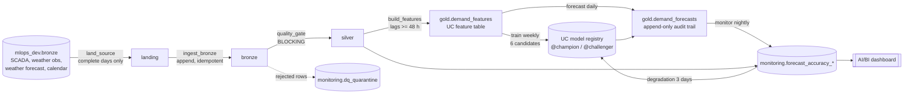
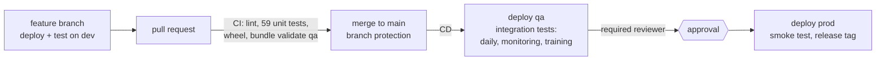

# Water demand forecasting - day-ahead, hourly, on Databricks

Every morning the platform forecasts **tomorrow's city-wide water demand for Dubai, hour by hour (24 values)**,
checks its own inputs before it forecasts, measures its accuracy every night, retrains itself weekly (and when
accuracy degrades), and promotes a new model only when it is measurably better. Code moves from dev to qa to prod
through CI/CD with tests and a human approval gate; models never move, each environment trains its own.

| | |
|---|---|
| Target | `demand_m3h` - hourly demand for site `DXB-CITY-TOTAL`, Dubai local time (UTC+4) |
| Forecast | issued 05:00 UTC (09:00 Dubai) on day D for 00:00-23:00 of D+1 |
| Current accuracy (12-month backtest) | **2.6 % MAPE** for the shipped model (`blend_ridge_lgbm`) vs 3.4 % for the previous production model (-24 %) |
| Evidence | [`notebooks/01_eda.ipynb`](notebooks/01_eda.ipynb), [`notebooks/02_modelling.ipynb`](notebooks/02_modelling.ipynb), [`docs/model_card.md`](docs/model_card.md) |

---

## 1. Architecture



* **Deploy code, not models.** The wheel built from `src/` is the only artefact promoted between environments.
  Each environment trains its own model on its own data. Only prod's `@champion` produces forecasts that matter.
* **One workspace, three catalogs** (`ewec_demo_dev`, `ewec_demo_stage`, `ewec_demo_prod`). Isolation is enforced
  by Unity Catalog grants and one service principal per environment, not by workspace boundaries.
* **Leakage-safe by construction.** At issue time the newest complete day of actuals is D-1, so the shortest
  demand lag is 48 h (`features.py` refuses anything shorter). Training uses the *weather forecast*, never the
  observed weather of the target day. See the notebooks for why `lag_24` is excluded and what it would be worth.

## 2. Environments

| | dev | qa (`stage`) | prod |
|---|---|---|---|
| Catalog | `ewec_demo_dev` | `ewec_demo_stage` | `ewec_demo_prod` |
| Deployed by | you, `databricks bundle deploy -t dev` | CD on merge to `main` | CD after **manual approval** |
| Runs as | your user | `sp-water-qa` | `sp-water-prod` |
| Schedules | paused (on demand) | paused (CD runs it) + quarterly refresh | **live** |
| History | 2026-01-01 -> replay from 2026-06-30 | 2024-09-15 -> live | 2024-01-01 -> live |
| Purpose | development, fault drills | integration tests on every release | the forecast of record |

## 3. How the daily cycle works in real time

`src/water_forecasting/clock.py` makes the pipeline behave like a real operation:

* **Only complete days are landed.** A day is complete once the Dubai calendar has moved past it; today is
  never landed, and no weather-forecast vintage issued after "now" is used.
* **Catch-up is self-healing.** An environment that is behind (fresh bootstrap, missed runs, refreshed lower
  env) lands the WHOLE gap up to yesterday in one run, and `forecast()` / `monitor()` loop over every day
  still owed a forecast or a reconciliation - so a single missed run never leaves the pipeline permanently
  behind, and the forecast/accuracy history for the skipped days is backfilled automatically.
* **Freshness is measured against the wall clock.** A same-day re-run is a harmless no-op; a feed that stops
  delivering blocks the pipeline and alerts.
* **Bounded by the demo data.** `mlops_dev.bronze` (the source used by every environment) ends 2026-09-30.
  From 1 Oct the daily job blocks on `forecast_horizon_coverage` (no forecast vintage available) and alerts -
  correct behaviour for an exhausted feed, not a bug. Point `source.warehouse` at a live extract to remove
  this ceiling.

Go-live (2026-09-24): prod was bootstrapped with history to 2026-09-19 and caught up with four daily runs,
so `gold.demand_forecasts` holds the forecasts issued on 20-23 Sep plus today's, and the monitoring tables hold
reconciled errors for 21, 22 and 23 Sep. From then on the schedules below run every day.

## 4. Jobs (`resources/*.yml`)

| Job | Schedule (prod, UTC) | What it does |
|---|---|---|
| `setup` | once per environment | schemas -> history backfill -> quality gate -> features -> first model -> first forecast (idempotent) |
| `daily_forecast` | daily 05:00 | land next complete day -> bronze -> **quality gate** -> features -> forecast for tomorrow; a failed gate runs `blocked`, which fails the run and alerts |
| `monitoring` | daily 06:30 | reconcile yesterday's forecast with its actuals; if daily MAPE > 1.25x the champion's holdout MAPE for 3 consecutive days, trigger `training` |
| `training` | Sundays 03:00 + on degradation / CI | fit all candidates, log to MLflow, register the best as `@challenger`, promote to `@champion` only if >= 1 % better on >= 7 holdout days the champion never trained on |
| `refresh_from_prod` | quarterly (qa) | copy a contiguous window of prod silver to qa (730 days) / dev (180 days), retrain |

Failure alerts go to `var.alert_email` (`databricks.yml`).

## 5. Data quality gate

Row-level problems are quarantined with a reason code and the batch continues; batch-level problems block silver,
features and the forecast. Better no new forecast than a confidently wrong one.

| Check | Level | Rule |
|---|---|---|
| `null_value` | row -> quarantine | missing timestamp or demand (SCADA telemetry gap) |
| `out_of_range` | row -> quarantine | demand outside 0-200,000 m3/h, temperature outside 0-50 C |
| `duplicate_key` | row -> quarantine | same hour twice; the latest ingested version wins |
| `frozen_value` | row -> quarantine | >= 3 identical consecutive hourly readings (stuck meter) |
| `hourly_completeness` | **batch -> block** | more than 2 % of expected hours missing |
| `forecast_horizon_coverage` | **batch -> block** | weather forecast for tomorrow does not cover all 24 hours |
| `freshness` | **batch -> block** | no new actuals and silver does not yet hold yesterday |

## 6. Model

Six candidate families compete at every training run (`project_config.yml > model.candidates`):
`seasonal_naive_168`, `ridge_fourier`, `lightgbm`, and the growth-aware `lightgbm_trend`, `ridge_interactions`
and `blend_ridge_lgbm`. Demand grows about 10 % a year; the growth-aware models divide out a log-linear trend
fitted on the training history and extrapolate it, which raw tree models cannot do. The 12-month backtest in
`02_modelling.ipynb` compares 14 models across 6 families (including SARIMAX, Random Forest, an MLP and a GRU
seq2seq network); the details, limitations and follow-ups are in the [model card](docs/model_card.md).

## 7. Promotion flow (CI/CD)



* **CI** (`.github/workflows/ci.yml`, every PR): `ruff`, unit tests with coverage, wheel build, and
  `databricks bundle validate -t qa` against the real workspace as `sp-water-qa`.
* **CD** (`.github/workflows/cd.yml`, every merge to `main`): deploy qa as `sp-water-qa` and run the daily
  pipeline, monitoring and training there as integration tests; then wait for approval on the GitHub environment
  `prod`; then deploy prod as `sp-water-prod` and tag a release from `version.txt`.
  Manual inputs: `run_setup` (bootstrap) and `catch_up_days` (replay missed days).
* **Guards:** `main` is protected (the `test` and `validate-bundle` checks must pass before merging; this does
  not require a second reviewer - a solo-maintainer setting - and the repo admin can bypass it, which a team
  setting should turn off); qa/prod targets deploy only from `main` (`git.branch`) and always run as their
  service principal (`run_as`); `tests/test_bundle_config.py` fails if the bundle and `project_config.yml`
  disagree on catalogs or if non-prod schedules are unpaused.

## 8. Security

| Principal | Privileges |
|---|---|
| `sp-water-qa` | ALL PRIVILEGES on `ewec_demo_stage`; SELECT on `mlops_dev.bronze` (source); SELECT on `ewec_demo_prod.silver` (quarterly refresh); CAN_USE on the SQL warehouse |
| `sp-water-prod` | ALL PRIVILEGES on `ewec_demo_prod`; SELECT on `mlops_dev.bronze` (source); CAN_USE on the SQL warehouse |
| workspace `users` | CAN_VIEW on jobs and dashboards (dashboards run with the owning principal's credentials) |

Service principal OAuth secrets live only in the GitHub environments `qa` and `prod` (secrets
`DATABRICKS_CLIENT_ID` / `DATABRICKS_CLIENT_SECRET`, variable `DATABRICKS_HOST`); they expire 2028-09-22.

Grant script (run once by a metastore admin; application IDs in `databricks.yml > run_as`):

```sql
GRANT ALL PRIVILEGES ON CATALOG ewec_demo_stage TO `<sp-water-qa application id>`;
GRANT ALL PRIVILEGES ON CATALOG ewec_demo_prod  TO `<sp-water-prod application id>`;
GRANT USE CATALOG ON CATALOG mlops_dev TO `<sp-water-qa>`;   GRANT USE SCHEMA, SELECT ON SCHEMA mlops_dev.bronze TO `<sp-water-qa>`;
GRANT USE CATALOG ON CATALOG mlops_dev TO `<sp-water-prod>`; GRANT USE SCHEMA, SELECT ON SCHEMA mlops_dev.bronze TO `<sp-water-prod>`;
GRANT USE CATALOG ON CATALOG ewec_demo_prod TO `<sp-water-qa>`; GRANT USE SCHEMA, SELECT ON SCHEMA ewec_demo_prod.silver TO `<sp-water-qa>`;
```

## 9. Monitoring dashboard

`resources/dashboard.yml` deploys **"Water demand forecasting (&lt;env&gt;)"** to every environment (Databricks
> Dashboards). Pages: *Daily operations* (KPIs, tomorrow's forecast, forecast vs actual, daily MAPE),
*Accuracy detail* (hourly errors), *Data quality* (gate results, quarantine), *Models* (champion / challenger
history). All results are also in MLflow (experiment `<bundle root>/water_forecasting_<env>_experiment`).

## 10. Runbook

| Situation | What to do |
|---|---|
| `daily_forecast` failed at `blocked` | Open the dashboard *Data quality* page or `monitoring.dq_results` for the run. Fix the source. If a bad batch was landed, delete it from `landing.*` and `bronze.*` by `_batch_id` and re-run `daily_forecast`: it lands the day again. |
| `freshness` failed | The source delivered no new day. Check the SCADA extract; the job catches up automatically once data arrives (one day per run - run it again to catch up faster). |
| Accuracy degraded | `monitoring` triggers `training` automatically; the new model is promoted only if it beats the champion. Check the *Models* page for the decision. |
| Roll back a model | `set_registered_model_alias` `@champion` to the previous version (UC Catalog Explorer > Models, or MLflow client); forecasts use the alias at the next run. |
| Roll back code | Revert the commit on `main`; CD redeploys qa and, after approval, prod. |
| New environment / disaster recovery | Create catalog + grants, configure the GitHub environment, run CD manually with `run_setup = true` and `catch_up_days = <days since history_end>`. |
| Fault drill (demo) | In dev (replay sandbox): `databricks bundle run daily_forecast -t dev --params fault=missing_forecast` (or `meter_outage`). The gate blocks and the run fails with an alert. |

## 11. Developer workflow

```bash
python -m venv .venv && .venv/Scripts/activate        # Windows; use bin/activate elsewhere
pip install -e ".[dev,test,dl]"
pytest -q                                              # 59 tests, ~3 s, no cluster
ruff check . && ruff format --check .
databricks auth login --host https://dbc-b9cbb106-0455.cloud.databricks.com --profile water-profile
databricks bundle validate -t dev --profile water-profile
databricks bundle deploy -t dev --profile water-profile
databricks bundle run daily_forecast -t dev --profile water-profile
```

Notebooks run on Databricks (they use the attached Spark session) or locally: the first local run pulls the
source tables through a SQL warehouse (`DATABRICKS_CONFIG_PROFILE`, optional `DATABRICKS_WAREHOUSE_ID`) and
caches them in `data/cache/` (git-ignored). Everything environment-specific is in `project_config.yml`
(catalogs, history windows, candidates, thresholds) and `databricks.yml` (hosts, identities, schedules).

## 12. Repository layout

```
databricks.yml                 bundle: targets, identities, variables
project_config.yml             runtime config per environment
resources/                     jobs (setup, daily_forecast, monitoring, training, refresh) + dashboard
scripts/                       thin job entry points (00_setup ... 08_refresh_from_prod, 99_fail)
src/water_forecasting/
  clock.py                     wall-clock rules: complete days, catch-up, freshness
  pipeline.py                  land -> bronze -> gate -> silver -> features -> forecast -> monitor
  quality.py                   row + batch quality checks
  features.py                  leakage-safe features (lags >= 48 h, weather forecast, calendar, Ramadan, Eid)
  modeling.py                  candidate families, growth-aware wrappers, metrics
  training.py / registry.py    MLflow + UC registry, champion / challenger
  monitoring.py / decisions.py reconciliation, promotion and retraining rules
  exploration.py               source loader for the notebooks (not used by the pipeline)
notebooks/                     01_eda.ipynb, 02_modelling.ipynb (executed, with conclusions)
docs/model_card.md             model card
tests/                         59 unit tests (pure pandas, no Spark)
```

## 13. Limitations and next steps

* The source data (`mlops_dev.bronze`) and its weather forecast are realistic simulations; accuracy on the live
  SCADA feed must be confirmed in the first weeks, which the monitoring job measures from day one.
* Next: calibrated P10/P90 intervals (validated in the notebook, 82 % coverage for a nominal 80 %), the MLP as a
  phase-2 candidate (~2.5 % MAPE as part of an ensemble), and a decision on a midnight issue time (`lag_24`, -4.2 %).
* No real-time serving endpoint: forecasts are batch, written to a table, which fits day-ahead planning.
